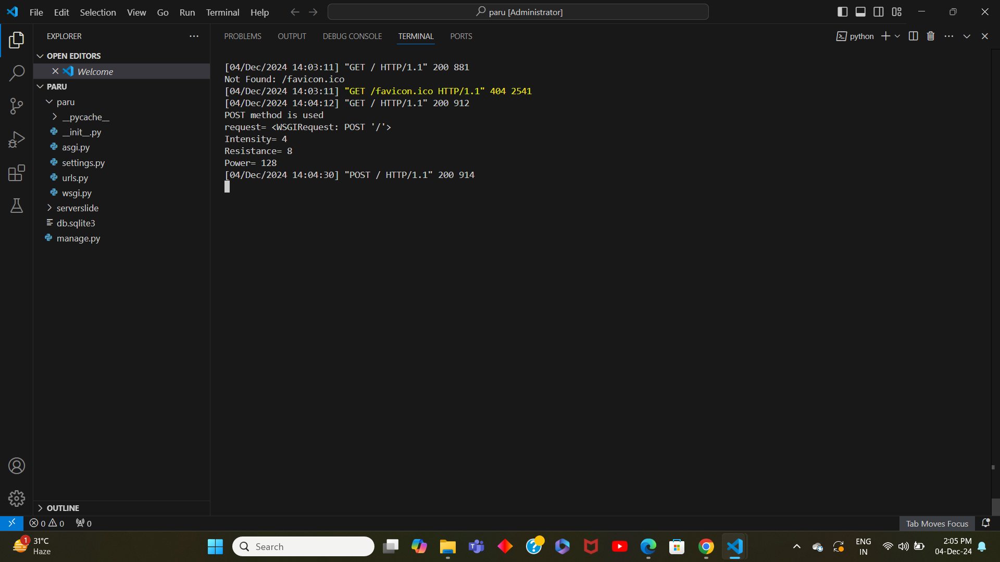
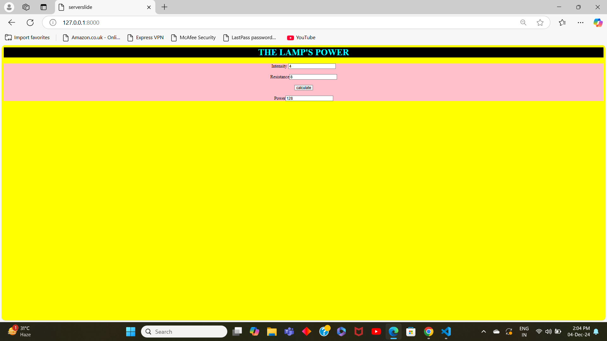

# Ex.05 Design a Website for Server Side Processing
## Date:04/12/2024

## AIM:
 To design a website to calculate the power of a lamp filament in an incandescent bulb in the server side. 


## FORMULA:
P = I<sup>2</sup>R
<br> P --> Power (in watts)
<br> I --> Intensity
<br> R --> Resistance

## DESIGN STEPS:

### Step 1:
Clone the repository from GitHub.

### Step 2:
Create Django Admin project.

### Step 3:
Create a New App under the Django Admin project.

### Step 4:
Create python programs for views and urls to perform server side processing.

### Step 5:
Create a HTML file to implement form based input and output.

### Step 6:
Publish the website in the given URL.

## PROGRAM :

```
exp5.html

<html>
    <head>
        <title>serverslide</title>
        <style>
            body{
                background-color:yellow;
            }
            h1{
                background-color: black;
                color: cyan;
            }
            form{
                background-color: pink;
            }
        </style>
    </head>
    <body>
        <h1 align="center">THE LAMP'S POWER</h1>
        <form align="center"method="post">
            
            Intensity <input name="I" value="{{i}}">
            <br>
            <br>
            Resistance<input name="R" value="{{r}}">
            <br>
            <br>
            <input type="submit" value="calculate">
            <br>
            <br>
            Power<input name="power"value={{power}}>
        </form>
    </body>
</html>


views.py

from django.shortcuts import render 
def lampspower(request): 
    context={} 
    context['power'] = "0" 
    context['i'] = "0" 
    context['r'] = "0" 
    if request.method == 'POST': 
        print("POST method is used")
        i = request.POST.get('I','0')
        r = request.POST.get('R','0')
        print('request=',request) 
        print('Intensity=',i) 
        print('Resistance=',r) 
        power = (int(i)*int(i))*int(r)
        context['power'] = power 
        context['i'] = i
        context['r'] = r 
        print('Power=',power) 
    return render(request,'serverslide/exp5.html',context)

urls.py

from django.contrib import admin 
from django.urls import path 
from serverslide import views 
urlpatterns = [ 
    path('admin/', admin.site.urls), 
    path('lampspower/',views.lampspower,name="lampspower"),
    path('',views.lampspower,name="lampspower")
]

```

## SERVER SIDE PROCESSING:


## HOMEPAGE:


## RESULT:
The program for performing server side processing is completed successfully.
